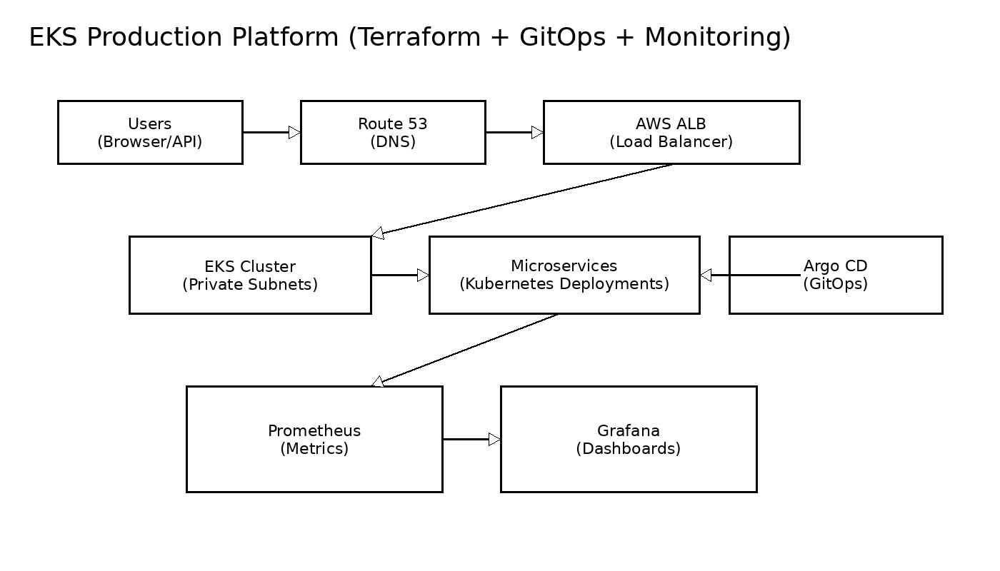

# Production-Grade AWS EKS Platform (Terraform + GitOps + Monitoring)


Production-grade Kubernetes platform built on AWS using Terraform, GitOps, and enterprise observability tooling.

This project demonstrates real-world DevOps / SRE engineering practices including Infrastructure as Code, secure Kubernetes provisioning, GitOps deployment automation, ingress and TLS configuration, and full observability integration.

Designed to mirror enterprise production environments used by modern cloud-native companies.

---

# Architecture



This platform provisions and operates a secure, scalable AWS EKS cluster using production best practices.

---

# Live Demo

Example endpoint:

https://demo.example.com

Architecture and deployment are fully automated via Terraform and GitOps.

---

# Key Features

## Infrastructure as Code

- AWS VPC with public and private subnets
- NAT Gateway and secure networking
- Fully provisioned EKS cluster
- Managed node groups with autoscaling
- IAM Roles for Service Accounts (IRSA)

## Kubernetes Platform

- Production-ready Kubernetes cluster
- AWS Load Balancer Controller integration
- ALB ingress provisioning
- Secure TLS termination using ACM

## GitOps Continuous Delivery

- Argo CD automated deployment
- Declarative Kubernetes manifests
- Fully reproducible environments
- Git-driven deployment workflow

## Observability and Monitoring

- Prometheus metrics collection
- Grafana dashboards
- Cluster and workload monitoring
- Production-style observability stack

## Security Best Practices

- Private subnets for worker nodes
- Least privilege IAM configuration
- No static credentials
- Role-based authentication

## Automation

- Fully automated provisioning via Makefile
- GitHub Actions CI pipeline ready
- Zero-manual-edit deployment capability

---

# Tech Stack

## Cloud

- AWS (EKS, VPC, IAM, Route53, ACM, ALB)

## Infrastructure as Code

- Terraform

## Container Orchestration

- Kubernetes
- Helm

## GitOps

- Argo CD

## Observability

- Prometheus
- Grafana

## Automation

- Makefile
- GitHub Actions

## Networking

- AWS Load Balancer Controller
- Route53 DNS automation

---

# DevOps Skills Demonstrated

## Infrastructure Engineering

- Terraform infrastructure provisioning
- AWS networking and IAM design
- Secure Kubernetes cluster provisioning

## Platform Engineering

- Kubernetes cluster configuration
- Helm-based application deployment
- Ingress and load balancer integration

## DevOps Automation

- GitOps deployment model
- CI/CD pipeline integration
- Fully automated infrastructure lifecycle

## Security Engineering

- IAM Roles for Service Accounts (IRSA)
- Private networking architecture
- TLS and certificate automation

## Observability Engineering

- Prometheus monitoring
- Grafana dashboards
- Cluster telemetry integration

---

# Repository Structure

```
eks-production-platform/
├── terraform/
│   ├── versions.tf
│   ├── providers.tf
│   ├── variables.tf
│   ├── vpc.tf
│   ├── eks.tf
│   ├── iam-ebs-csi.tf
│   ├── aws-auth.tf
│   └── outputs.tf
│
├── kubernetes/
│   ├── deployment.yaml
│   ├── service.yaml
│   ├── ingress.yaml
│
├── argocd/
│   └── application.yaml
│
├── monitoring/
│   └── kube-prometheus-stack-values.yaml
│
├── docs/
│   └── architecture.png
│
└── .github/workflows/
    └── terraform-plan-apply.yml
```

---

# Quick Start

## Provision infrastructure

```
cd terraform
terraform init
terraform apply
```

## Configure kubectl

```
aws eks update-kubeconfig \
--region <region> \
--name <cluster-name>
```

## Verify cluster

```
kubectl get nodes
```

## Deploy application

```
make deploy
```

---

# GitOps Deployment Flow

1. Commit changes to Git repository  
2. Argo CD detects changes automatically  
3. Argo CD deploys application to Kubernetes cluster  
4. Platform reconciles state continuously  

No manual kubectl required.

---

# Monitoring Setup

Install Prometheus and Grafana:

```
helm upgrade --install monitoring \
prometheus-community/kube-prometheus-stack \
-n monitoring \
--create-namespace
```

Access Grafana:

```
kubectl port-forward svc/monitoring-grafana 3000:80 -n monitoring
```

---

# Security Design

Production security best practices implemented:

- Private subnet worker nodes  
- IAM Roles for Service Accounts  
- TLS encryption using ACM  
- Secure ingress configuration  
- Least privilege access model  

---

# CI/CD Pipeline

GitHub Actions pipeline supports:

- Terraform validation  
- Terraform plan  
- Terraform apply  
- Infrastructure deployment automation  

---

# Why This Project Exists

This project was built to demonstrate real-world DevOps and Platform Engineering skills including:

- Infrastructure automation  
- Kubernetes platform engineering  
- GitOps deployment model  
- Cloud security best practices  
- Observability integration  

This repository serves as a production-style DevOps portfolio project.

---

# Screenshots

Add screenshots here:

## Kubernetes Nodes

```
kubectl get nodes
```

## Argo CD Dashboard

docs/argocd-dashboard.png

## Grafana Dashboard

docs/grafana-dashboard.png

---

# Cleanup

Destroy infrastructure to avoid AWS charges:

```
cd terraform
terraform destroy
```

---

# Author
# Olusegun Mayungbe
DevOps Engineer | Cloud Engineer | Platform Engineer  

GitHub: https://github.com/oluadepe
LinkedIn: https://linkedin.com/in/molusegun  

---

# License

MIT License
